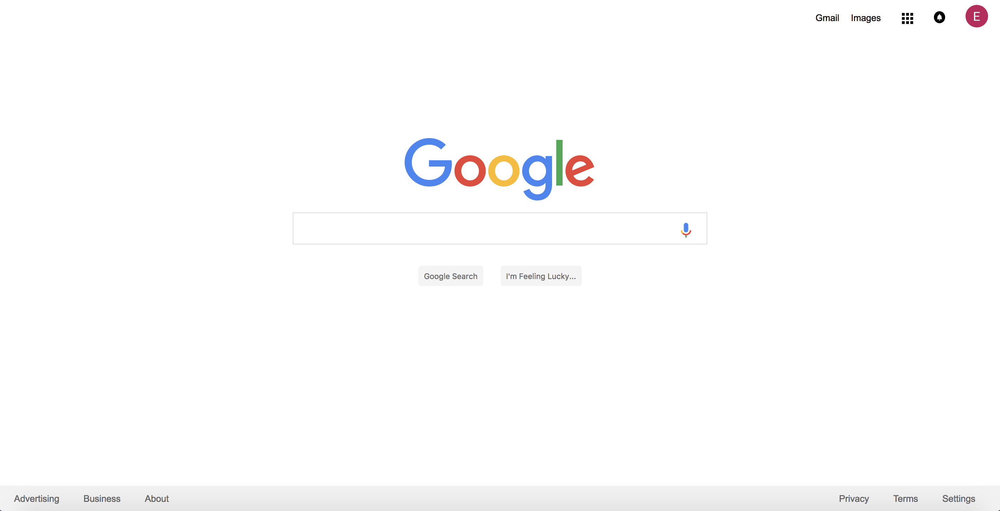
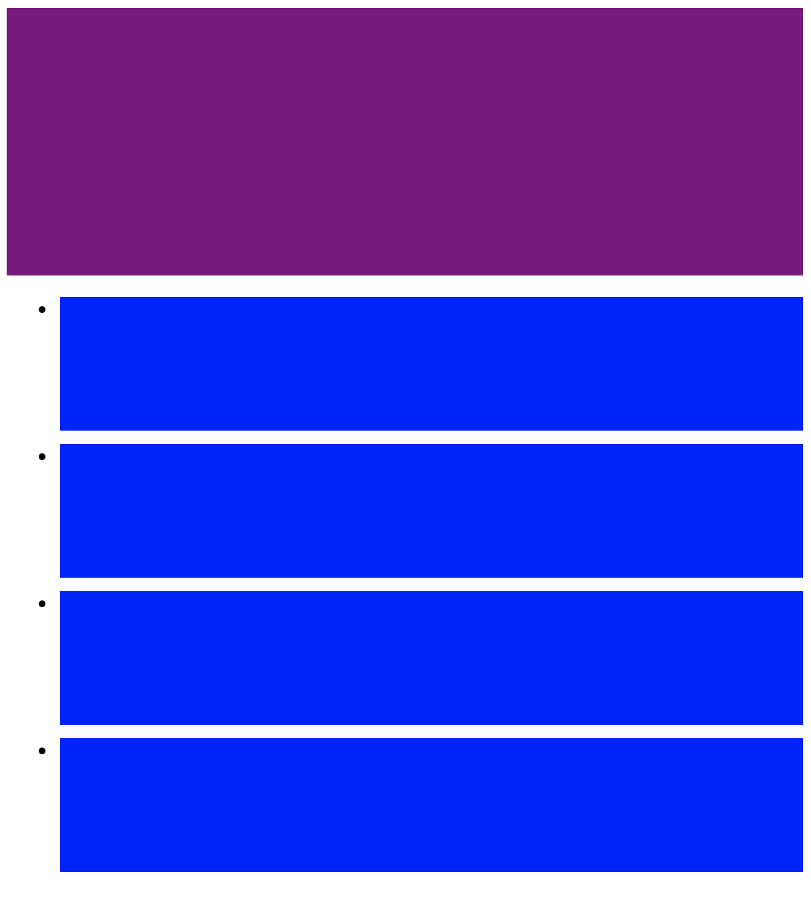

## CSS practice
Practicing CSS through Google and Facebook clones as well as media queries.

## Github Link:
[CSS GitHub](https://github.com/eddieatkinson/css101)

## Technologies used:
**Languages:**
* HTML5
* CSS

## Screenshots:
Google clone:

Media query - Large screen:

Media query - Small screen:

